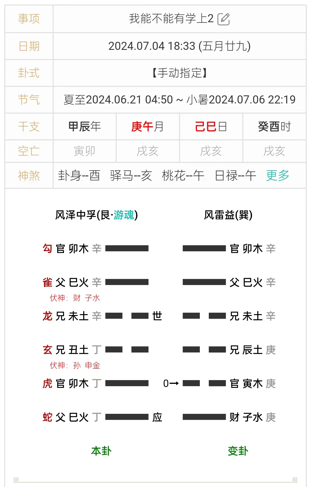
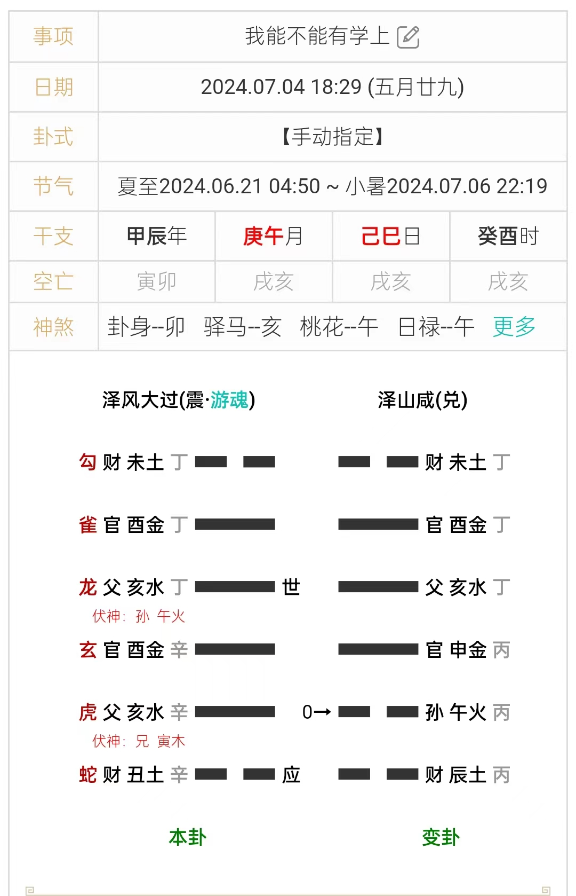
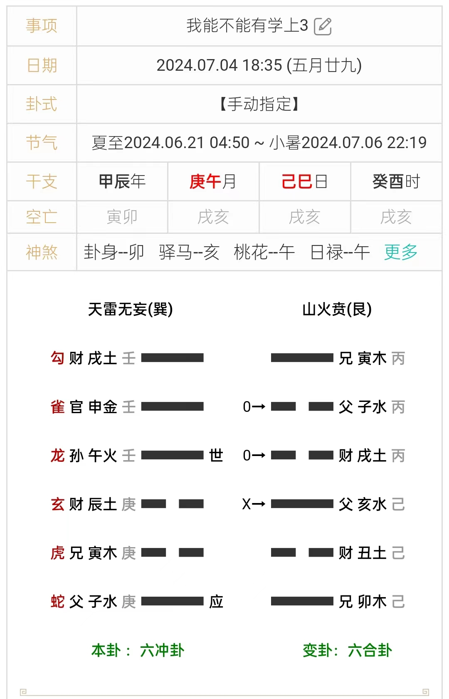
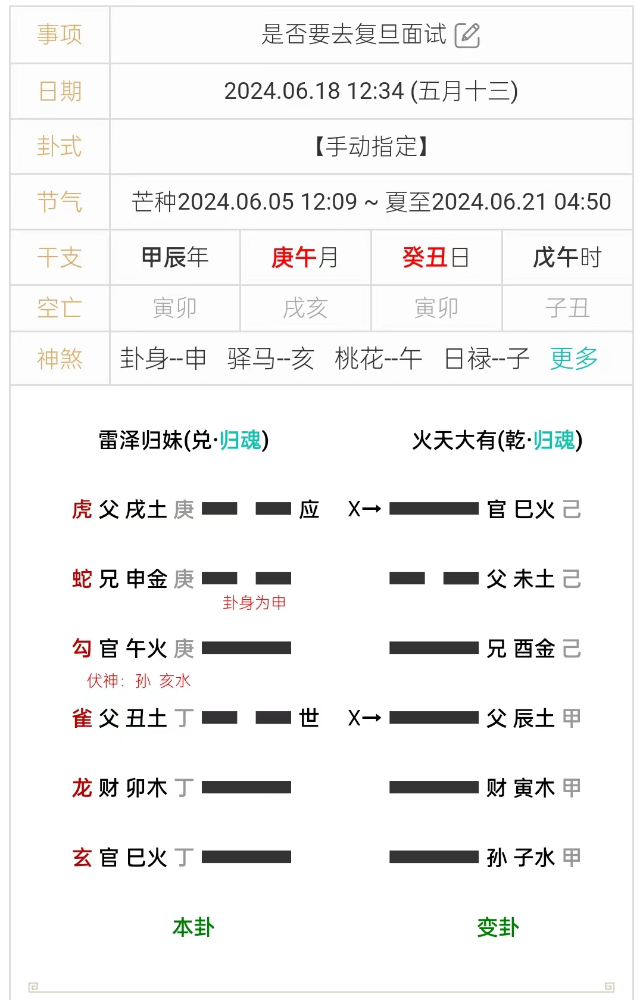
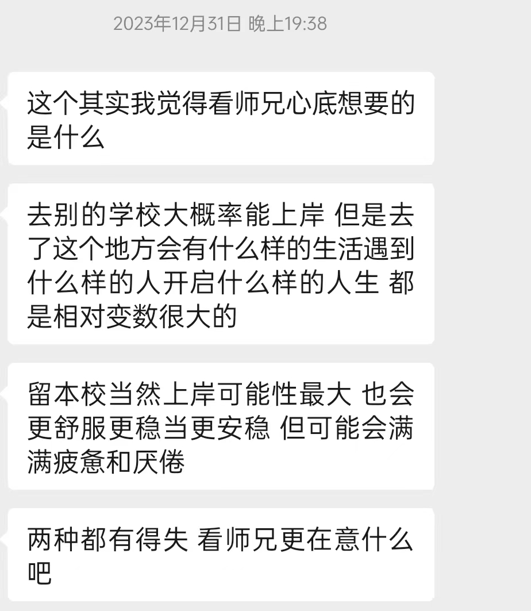
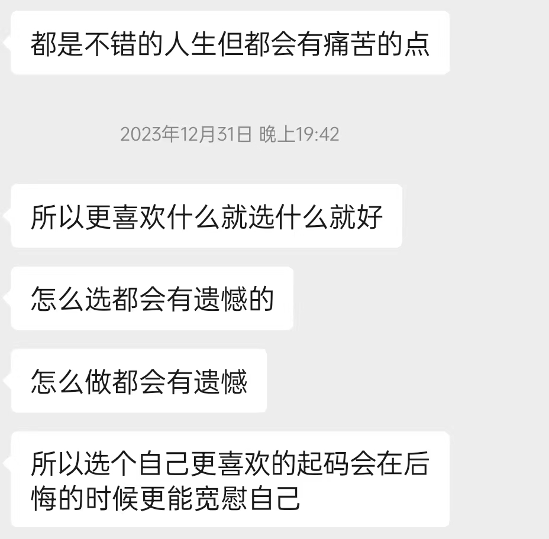

# 夏令营总结DLC --玄学篇

2024.7.10 16:04 总结    **赵宸**

## 诸葛神数(梅花的一个小分支) 夏令营求占汇总

我用来八字排盘的软件上次更新多了一个诸葛神数的应用, 后面我就简单学习了一下求签.**下面这些签都是我在夏令营备考和考试期间求得的签**, 准确率高的离谱(新手保护是这样的), 彻底的改变了我对梅花易数的看法. 后面的二级标题就是我求的签的签文, 然后是求签的时间背景以及官方对此签的解析.最后是我的分析(有些梅花诗的解析我就照搬过来了,还挺明显的), 仅供参考.

### 湖海意悠悠，烟波下钓钩；若逢龙与兔，名利一齐周。

高瓴面试前占有没有学上(连出2次此签)和信院面试前占有没有学上, 均得 **解变师**签.

**此签主交卯辰流年，名利双收又逢卯辰生年之人，亦得提拔扶助之德，占者细思量遵行之。**

结果来看肯定是有学上的. 在广阔的湖面上, 一个p人随意的甩了下钩子钓鱼, 虽然在钓鱼, 但是意不在此(我除了信院之外, 其他的夏令营确实都是考着玩的). 碰见龙和兔既能让其他人认识我,又能有学上(言外之意就是没碰见龙与兔真的就是一无所获). 今年是甲辰龙年,所以肯定有学上; 最后发offer的地方导师和对于我的录取有决定意义的人肯定都是属龙或者属兔.

诸葛神数一共374签, 我前前后后一共求了不到十签, 却有三次起到这个签, 说明**这个签应该是我整个夏令营的主要趋势**. 除此签外, 本文剩下的记录次序是按求签的时间顺序排列的.

### 倾一杯，展愁眉；天地合，好思为

六月底复习时占, 得 **中孚变损**签

**此签先忧後乐，无聊之际且破涕为笑，以自排遣，及天地交泰时会已至，方能展生平之怀抱，占者须好自为之，自有神力来助也。**

这是我六月底在复习的时候占的. 我复习的时候心烦意乱, 总感觉自己复习不完, 又在纠结要不要去复旦考试, 因此那天半夜在从自习室回宿舍的路上求了第一签. 签的意思还是很好懂的, 感觉犯愁的时候就喝一杯, 排解一下; 等到时机成熟, 就是我大展身手的时候. 没啥信息量, 但是很精确的捕捉到了我当时的状态, 确实起到了一定的排解作用.

### 腰下佩青萍，步入金銮殿；覆护三山，千锤百练。

去复旦考试前占考试吉凶, 得 **革变既济**签.

**此签火候既到，大丹自成，凡事非一蹴可及，其通显者必自有所有也，占者勿徒把向偶之憾。**

这个签非常精准的描述了我当时的状态. 三山, 指沿海地区. 覆护, 先推翻后维护. 我全副武装但是只身以客场身份去上海考试,砸人家的场子,历经千锤百炼. 但这个签确实极大的提升了我的信心, 从求了这个签之后, 我的心态就平和了很多, 这种平和的心态一直维持到信院面试之前, 以至于我信院机试考砸了也没有太多波澜.

### 龙生头角，将沛甘霖，六七八早，好济苍生。

信院考后, 高瓴考前占, 得 **归妹变大壮**签

**此签暂时安守，好音即来，不出六七八三月中，定有亨通也望。占之者宜欣喜勿忧疑。**
$$
\begin{flalign*}
&龙生头角，必有争斗的象征，寓意着一场纠纷的发生。你不幸成为这场无休无止的争吵之一方，将要付出心力憔悴的代价。 \\

&当然，你很快便产生厌倦的情绪，希望早日中止这场纠纷。\\

&但事与愿违，骑虎难下，欲罢不能。就象农历六、七、八月的天气，骄阳似火，酷暑秋躁.\\
&人的心情也是火燥燥的，只盼早日下一场大透雨，把这烈焰并灭下去。\\

&事情绪束，还要到农历九月，才会有彻底的根本性的好转。\\
&那时，随着九月重阳(九月九日)带来充足的雨水，气候才逐渐凉爽，所以人才会感到有了一线生机。\\

&你的生活中出现了麻烦，并且时间长，拖得久，你千万不要心浮气躁，那祥伤害得最探的反倒是自己.\\
&这支签告诉你，要好自为之，冷静地拖延到农历九月中旬以后。&
\end{flalign*}
$$
信院考完,感觉自己的发挥并不算出彩, 免不了的近身肉搏.这个签就说的很明确, 要我等, 等到农历六七八月, 肯定能有好消息. 那我就等, 过程是曲折的, 前途是光明的.

### 安坦路平夷，云中一雁飞；桃花逢骤雨，水畔女频啼。  

高瓴面试前占面试结果, 得 **井变坎**签

**此签若对男女间相恋、婚姻、结褵等，恐属大不利，如问他事，亦波折重重。**

“签诗以生动的画面，交叉叠印有如电影象太奇的手法，为我们讲述了一个悲惨的故事：

“男主人公为了功名利禄，离乡背升，奔向远方。他形单只影，就象云中那只离群的孤雁，冰雨和风、历尽风霜。这只孤独的大雁何尝又不象女主人公呢？她同样在企盼和默祷里，度日如年地独守闺中。不幸的事情终于发生，暴雨，这个摧花杀手，冷酷无情，兽性大发，骤然间扑向桃花，强行旅暴，任意蹂躏……江边，女主人公在不停地啼哭。丈夫不在身边，没有人为她作主，没有人去讨回公道，她悲忿满腔、羞惋难当……”

**省流:要寄**. 非常典型的女子的丈夫出征, 女子孤苦无依的象.意思很明白, 我考高瓴是没有本校buff的, 出个三长两短学校帮不上忙, 结果就是只能无助的哭哭啼啼, 和周围安静的环境形成鲜明对比...

### 遇不遇，逢不逢；月沈海底，人在梦中。

高瓴面试前占面试结果, 得 **离变贲**签

**此签有壮夫失路，贫女伤春之象，後两句垂戒至深，占者切莫仍得失萦怀，忧思丧志，不如听其自然为达观也。**

这签**就差放明面上骂我了**...我考高瓴那就是白日作梦, 你幻想中的一切都不会发生, 去高瓴读硕士根本就不是一个可行解. 所以我应该听其自然, 老老实实的面试考砸, 然后遗憾候补.这一签和上一签是我同时先后求的, 求完第一签我还不死心,**第二签求完彻底老实了, 关掉PPT安心开摆了**.

起完这个签, 我就不占高瓴了, 转而问我有没有学上, 然后就出了本文开头的第一支签, 感觉有点魔幻, 不相信同一时间, 就因为问的问题有细微区别(占有没有学上的占卜算上信院, 但是单占高瓴结果很差很差), 就换了个字重新起, 结果还是这个签.

质疑梅花易数, 理解梅花易数, 学习梅花易数.

## 六爻占卜结果

​	整个夏令营期间, 我前前后后一共起了四个卦, 一个是在复习期间, 我占我要不要去复旦考试, 但是当时这个卦解错了, 导致我做了错误的选择, 确实我个人也很想去那边玩玩. 从复旦回北京的火车上, 我连续拒绝了两个老师, 当时心思很乱, 第二天还要考本院夏令营, 于是就做了一次三占, 顾名思义,就是连续占三次.事实证明是有效的, 连占的三次一次比一次的卦象清晰. ~~这里我就不解了, 这玩意讲起来太麻烦了.~~**我的讲解尽量避开专业名词, 从象法角度解释, 用到的名词也会解释.**

### 出行卦-要不要去复旦面试

​	首先起的是去复旦面试的卦, 当时我对夏令营还没啥概念,听了师兄师姐的建议, 就给各个老师发套瓷信, 后来通过了一位导师的面试, 但是后来得知复旦不管住宿和车票的报销, 所以当时有些犹豫到底要不要去, 就起了这个卦. 因为在这之前很久我已经没有老老实实的解过卦了, 大部分都是看一眼吉凶就扔了,所以这个卦我就狠狠的吃亏了.

​	庚午月癸丑日占得归妹变大有卦. 是出行卦,那就是兄弟爻申金为用,世应两个父母爻做旺兄弟爻,出行顺利. 到这里都没问题. 但我去上海之后仔细看这个卦我才发现, 这个卦不是单纯的告诉我出行顺利, 他还和我说了很多其他事.

​	父母爻在这种时间档口代表的就是文书,也就是录取offer.世应两个父母爻, 都在关键位置, 说明我至少面临两个offer的考验. 这个很好理解, 一个是我正在考的复旦, 还有一个是人大信院(其实还有人大高瓴, 但是我考到一半放弃了,所以没上卦, 起有没有学上的第三卦高瓴上卦了, 但是很明显和其他两个都不一样, 也说明高瓴考试的性质和信院复旦不一样, 一个考完了一个没考完). 这两个父母爻哪个代表本院, 哪个代表复旦呢?当时并不清晰,但是底下那个是父母爻变父母爻, 说明这个offer很稳定,上边那个是父母爻变官鬼爻回头生, 说明这个offer正在变好.底下那个丑土虽然得日令癸丑, 但是犯了太岁午火, 也就是那个月令,说明看似稳定, 实则一般;上边那个戌土同时得了日月帮助,还有回头生, 应该是最好的, 但是空亡了,也就是我当时看不见. 这个我当时看不见就很明确了, 应爻是人大信院, 那另一个世爻就是复旦. 复旦临朱雀, 口舌是非, 又犯了月令,不好.而且爻词“归妹以须，反归于娣”, 意思就是我在这场考试会原形毕露. 应爻虽然也不好, 但是是“妇承筐，无实；士刲羊，无血，无攸利”,单纯的不吉利, 无攸利而已,最后肯定是有惊无险. 所以这个卦就在暗示我, 我来复旦很顺利, 但是这场考试考完我会原形毕露,没有我给自己包装的那么出彩.确实我在面试的时候遇到了邱锡鹏, 他随便问几个问题就知道我是个三脚猫.这种吉中藏凶的卦, 说实话, 让我当时解还真的解不太明白, 因为好多事还没发生, 看不懂, 就比如我面试打肿脸充胖子“弄虚作假”被识破种种, 只有事后才知晓.

### 文书卦-我能不能有学上 三占

​	我在上海回北京的火车上连续起了三卦, 这三卦是递进式的, 一个比一个清晰,也从三个不同的方面告诉了我我可能面临的问题和遗憾. 第一占得到了一个大过卦变咸卦. 大过顾名思义, 有大的过错. 变的是九二爻, 这个大的过错就是老夫娶了少妻. 道德上不允许, 但是没有什么大的问题, 变卦一个泽山咸, 两情相悦, 我违背了道德,促成了一段两情相悦的佳话. 这是第一段用卦解的结果. 再看爻, 又是两个父母爻, 父母爻代表文书, 两个学校的考试情况. 两个父母爻都是亥水, 性质一样, 一个持世, 变化之后还是亥水, 表示这个卦很稳定, 应该最后是offer, 另一个变午火回头克, 这个凉了. 但是两个都冲了日建, 暗合月建.回头克的卦大概率凉了, 没有必要深究, 世爻亥水被两个亥水的枭印所生变卦还是亥水, 不怕克泄耗, 说明历经风浪时候仍然稳固. 说明两个offer凉了一个, 还有学上.具体哪个凉了, 我对应不上. 当然现在来看, 凉的是复旦.

​	第二卦中孚变风雷益卦, 我刚刚说这三卦层层递增, 第一卦是现象, 单从现象分不出来, 这个卦就设计能量输送和原理了, 自然也清晰许多. 先看卦辞, 中孚卦, 颇有天行健, 君子以自强不息的意思, 我只要老老实实来, 就不会出问题,因为变卦是益卦. 此外中孚卦虽听起来很正直, 其实不然, 这个卦是“利益输送”的典型代表, 为什么这么说呢, 因为这个卦是六四卦中唯一一个九二爻向九五爻暗中输送能量的卦. 碰巧我起到的九儿爻还动了. 名义上, 这个动的九儿爻会生初九爻的父母应爻, 但实际上它是在暗中生助九五爻的父母爻. 所以这个卦的两个父母爻对应非常清晰, 初九爻是明面上会帮助我但实际上不会帮助的, 也就是套瓷但是我最后拒绝的复旦; 九五爻是明面上只受安静的上九爻(本校buff)生助, 但实际上暗中得到最重要的九二爻帮助的人大信院. 这里的九二爻代表的自然就是导师, 或者说“人”. 结果是什么呢, 明明是在应爻且有九二生助也就是处在我面前而且好像有导师帮助的复旦, 被变卦回头克了, 九五爻巳火依旧坚挺.最后我的选择自然是九五爻也就是信院. 这卦里还有些别的东西, 比如代表导师的九二爻变了, 但是性质没变, 由阴性转阳性了; 代表学校的上九爻没变.这个卦是这三个卦里最清晰的一个, 既有变化关系和原理, 又没有涉及其他过去或者未来的东西, 当时我起完这一卦就已经不太想起了,但是本着三占的原则, 我又起了第三卦.

​	第三卦到目前为止我都没有完全看懂, 因为里面涉及了很多很多在我看来应该是未来才会发生的事.因为解完第二卦, 我就基本知道, 能去的那个是人大信院, 去不了的是复旦, 所以应该会很明显. 结果这个卦根本不需要这个先验知识, 因为这个象有明显的时间序.天雷无妄变山火贲卦.本卦一个父母爻用神在应爻,代表当前(从上海回北京的火车上)就一个offer, 后面变卦变出来两个父母爻, 一个化进一个回头克,回头克的那个与其他两个性质不一样, 而且落在了月日时的空亡, 应该代表的是高瓴(参营参了一半溜了, 和其他两个性质不一样). 死掉的那两个咱们暂且不看, 只看最后我选择的九五官鬼变父母爻人大信院. 本卦无妄九五爻: 无妄之疾, 勿药有喜. 说明我在保研的路上会遇到许许多多的问题,对这些问题最好的解决方法就是不管他, 慢慢的就会变好. 变爻的爻词还没有发生, 我猜测是我读研的情况, 爻词是在豪门集会上, 带着很少的礼品寻求人才, 开始很凶险, 最后很好. 豪门集会,我的师兄师姐和组里的实力都很厉害, 但是我能力有限, 刚进来会很不适应, 最后的结果是吉祥的.

​	解完了这个, 咱们再看看只有这个卦提到的高瓴. 本卦是六三爻, 讲的是这是场无妄之灾.事实上,我放弃高瓴确实是无妄之灾, 面试当天,导师给我打电话安排任务, 我在候考室,教务不让使用电话, 我没有办法, 只能放弃资格去接导师的电话, 结果最后也不是什么要紧的事情. 爻词中导致这场无妄之灾的唯一主观因素是主人公来到了那个是非小镇, 我唯一的问题就是参加了高瓴的考试.现在回想,我除了不考高瓴的考试能避免这个意外之外, 没有任何办法. 变卦的爻词向我解释了这件事的影响: 汗流浃背的向前奔跑, 测得事情越长久, 越吉利. 放弃就放弃吧, 没有什么顾虑可言.

​	最后是九四变爻回头生. 这个变爻很明显,代表的就是我自己的状态. 可贞, 无咎, 慢慢做,能熬出头来的.变爻讲的是: 那个强壮华丽的人向我们走来不是来抢劫的, 是来求婚的. 这件事不是坏事, 这件事之后, 我向我导师表明我最终会留在这里, 而导师也表示我的实力也允许这样做, 未尝不是好事.

​	为什么我要详细的讲第三卦呢, 因为当年在周易课上, 老师让我们抽一卦, 我从老师手里抽到的就是天雷无妄. 在我看来, 这个卦从初九到上九就是我整个大学的写照. 我在火车上抽到这个卦告诉了我, 我当前正处在九五爻的位置, 而这个勿药有喜的无妄之疾就是保研. 写到这, 感慨良多.

我不知道其他人是怎么看占卜术数的, 在我看来, 这个东西是有信息熵的, 有的时候会很隐晦, 有的时候会以你意想不到的顺序展开.但是我能直观的感受到, 我心诚求到的卦能高效的反馈我当前的状态, 但是随机数起的卦则和我当前的任何事没有任何瓜葛.更重要的, 他是个心灵慰藉, 管他黑猫白猫, 抓得住老鼠就是好猫.

最后附上我在冲浪的时候发现的一个好玩的问卷: https://www.allcounted.com/s?did=wpv5fzz8fpbau&lang=zh_TW, 2024占卜师大赛.据说去年最高正确率只有五十多, 我做了一下确实有原因, 一方面题问的很细, 很多东西不是专精这个根本看不出来, 另一方面很多题出的本身就有问题,比如问一个人到底是高中学历, 大学学历还是硕士学历. 这个东西和他的学习水平基本无关, 倒不如问他是九八五还是普通一本来的实在.anyway, 网址贴在这儿了, 有兴趣就来看看吧.

## 小彩蛋-RUC一位占卜师的占卜结果

他不想让其他人知道他会这个, 这里就只贴结果, 隐去他的姓名啦~

